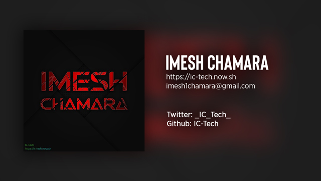

### Hello 👋
My name is Imesh Chamara. I'm self-taught developer. I do open source because I think it's nice to share knowledge with others.

### Projects
I only work with Windows and Linux platforms and have made apps, tools, websites, web servers, discord bot, telegram bots, etc. I have been code with C, C++, VB, C#, HTML, JavaScript, NodeJS. favorites languages are C and CJS. I like any language that use the basic C style coding. I have worked with React and made lightweight alternative ic-app. I usually don't care about very old browsers like Internet Explorer when build websites.

Take a good look around.

### Find me at
<a href="https://twitter.com/_Imesh_Chamara_"><h4>Twitter</h4></a>

### Random thought
*Your limits are an illusion in your mind.*
